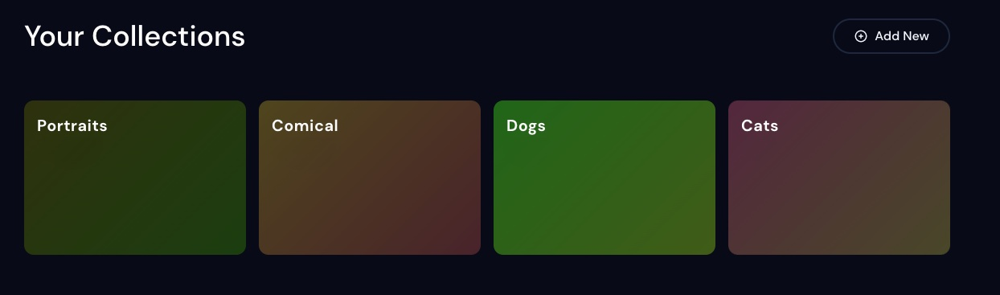
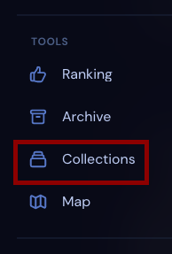
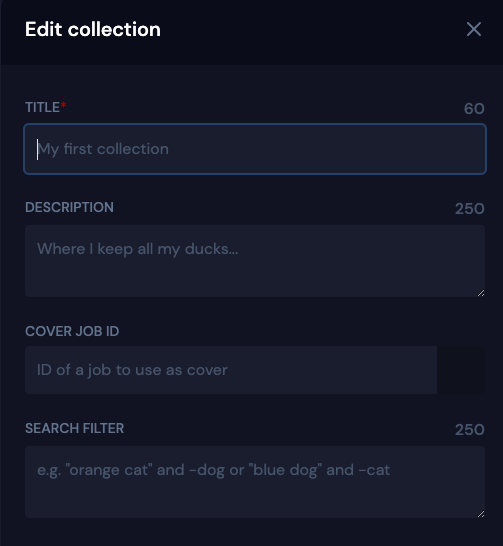
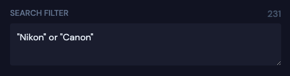
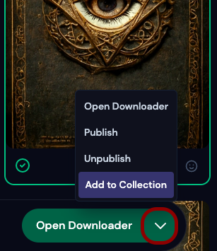
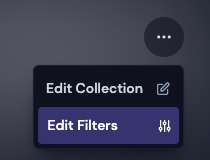
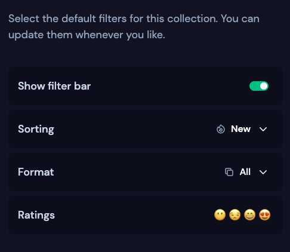

# Collections

### What are collections
Collections are a great way to organize and categorize your work in a streamlined way. 
 * Auto-curation: Automatically add new and existing images that meet your search criteria. 
 * Narrow down results: Choose which types of images should show in your collections with filters

<!--  -->

### Where are my collections

Your recently created collections can be found on your [profile](https://beta.mj-gallery.com/app/), or by clicking on the [Collections](https://beta.mj-gallery.com/app/collections/) shortcut in the navigation bar. 

### Creating a collection

### Search Filters 
Add all jobs that contain 1 or more specified keywords
The following search filter will add for all prompts that contain either the words "Nikon" or "Canon".

 

### Manual jobs 
Add individual jobs to a collection. 

1. Select jobs using "select mode" and then click the arrow next to the download button. 
2. Click Add to collection
3. Select the collection and close the window
 
 *Workspace collections [In Development] - All jobs generated in a workspace are added to a collection*

### Collection wide filters
Choose the default filters to apply to jobs in this collection. 

Regarding Rankings in Collections:  😶 😒 😄 😍 

<ul><li>You may select multiple rankings to show.</li> 
<li> By default, all ranks are selected</li>
<li> 😶 shows you images you have not yet ranked</li>

---

### Modify or remove collections

Modify or remove collections from the [Collections](https://beta.mj-gallery.com/app/collections/) page

### Who can see my collections?
Collections are not visible to other users who visit your [profile](https://beta.mj-gallery.com/app/) until published.

