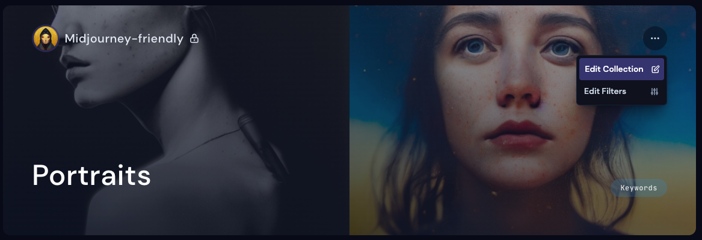

# Collections

## What are collections
Collections are a great way to organize and categorize your work in a streamlined way. 
 * Auto-curation: Automatically add new and existing images that meet your search criteria. 
 * Narrow down results: Choose which types of images should show in your collections with filters

<!--  -->

## Where are my collections

Your recently created collections can be found on your [profile](https://beta.mj-gallery.com/app/), or visit https://beta.mj-gallery.com/app/collections/ to view all created collections.

There are three main ways to set up a collection.
 * Manual jobs -  Pick individual images to move to a collection
 * Search Filters - Add all jobs that contain 1 or more keywords
 * Workspace collections - All jobs generated in a workspace are added to a collection

## Modify or remove collections

 Modify or remove collections from the [Collections](https://beta.mj-gallery.com/app/collections/) page

Edit a collection

Additionally you can find an edit button inside individual collections by clicking the three dots at the top over the page. 

## Who can see my collections?
Collections are not visible to other users who visit your [profile](https://beta.mj-gallery.com/app/) until published.

