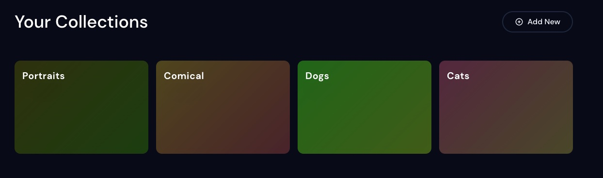

# Collections

## What are collections
Collections are a great way to organize and categorize your work in a streamlined way. 
 * Auto-curation: Automatically add new and existing images that meet your search criteria. 
 * Narrow down results: Choose which types of images should show in your collections with filters

<!--  -->

## Where are my collections

Your recently created collections can be found on your [profile](https://beta.mj-gallery.com/app/), or by clicking on the [Collections](https://beta.mj-gallery.com/app/collections/) shortcut in the navigation bar. 

## Creating a collection

### Search Filters 
Add all jobs that contain 1 or more specified keywords

 

*note:* the above search filter will add for all prompts that contain either the words "Nikon" or "Canon".

### Manual jobs 
 Select individual images with the "image picker" tool to move to a collection

 
 * Workspace collections - All jobs generated in a workspace are added to a collection

## Modify or remove collections

Modify or remove collections from the [Collections](https://beta.mj-gallery.com/app/collections/) page

### Edit existing collections

### Remove existing collections

## Who can see my collections?
Collections are not visible to other users who visit your [profile](https://beta.mj-gallery.com/app/) until published.

