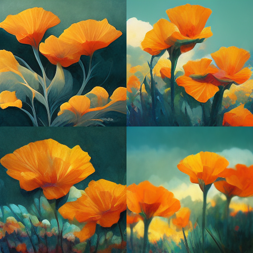
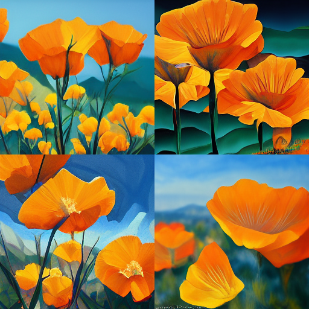

# Imagine Parameters Illustrated

### Basic Structure

Parameters options that change how the images generate. A full `/imagine` command might contain several things, like an image URL, image weights, algorithm versions, and other switches.\
\
`/imagine` parameters should follow the below order:

"Switches" in this context means controls passed to the bot using a "--" parameter. For instance, the command `/imagine hi there --ar 3:2` has a text prompt, and a parameter for the aspect ratio using the "--ar" instruction with a "3:2" value.

### Sizes

#### **Width and Height**

`--aspect` or `--ar` Makes it so the generation will have an aspect ratio as close as possible to the desired one. It can be a reduced ratio, such as `3:2`, or it can be reducible, such as `1920:1280`. If not specified, images will have a square aspect ratio, equivalent to `--ar 1:1`.

If we want our image to have a 3 by 2 aspect ratio, we should write `--ar 3:2` at the end of our prompt.

Please note that the ratio gets normalized, e.g. `--ar 3:2` is the same as `--ar 1920:1280`. In both cases the resolution will be 384 x 256 for the generation, 1536 x 1024 for the first upscale, and 1920 x 1280 for the upscale to max.

Only certain ratios are currently supported, while others are only supported when upscaling to maximum. If the chosen aspect ratio is not valid, the closest supported ratio will be used instead.

For more information, see [Understanding Image Sizes](resource-links/understanding-image-size.md).


Generating images while using `--wallpaper` and other shortcuts that contain `--hd` will use a different algorithm that is better suited for higher resolution images while having a less consistent composition. [See below for a visual example](imagine-parameters.md#high-definition).


### Algorithm Modifiers

#### Version 1

`--version 1` or `--v 1` uses the original Midjourney algorithm (more abstract, sometimes better for macro or textures). `--v 1` corresponds to the button in `/settings.`

.png>) prompt: **`vibrant california poppies` --version 1**

#### Version **2**

`--version 2` or `--v 2` uses the original Midjourney algorithm in use before July 25th, 2022.\
`--v 2` corresponds to the button in `/settings.`

 prompt: **`vibrant california poppies` --v 2**

#### Version **3**

`--version 3` or `--v 3` uses the current default Midjourney algorithm.\
`--v 3` corresponds to the  button in `/settings.`

\`\` prompt: **`vibrant california poppies --v 3`**

#### High Definition

`--hd` Uses a different algorithm that’s potentially better for larger images, but with less consistent compositions.

### Prompt Modifiers

#### --No

`--no` Negative prompting (e.g., `--no plants` would try to remove plants). This is like giving it a weight of -0.5.

.png>) prompt: **`vibrant california poppies --no grass`**

### Detail Modifiers

#### --Stop

`--stop` Stop the generation at an earlier percentage. Must be between 10-100.

.png>) prompt: **`vibrant california poppies --stop 50`**

#### --Uplight

`--uplight` Use "lighter" upscaler for upscales. Light results are closer to the original image with less detail added during upscale. `--uplight` corresponds to the  button in `/settings`.

Regular upscale  (left) vs Light Upscale  (right)

 

### Seeds

A seed number generate the random starting noise used in the begining of image generation. Using the same number across multiple prompts will use the same starting noise.

#### --Seed

`--seed` Sets the random seed (an integer), which can sometimes help keep things more steady / reproducible between generations.

For instance: the same prompt run twice, with no seed specified:

 

Versus specifying the seed and running it twice:

 

\`\`

#### --Sameseed

`--sameseed <number>` Sets the same seed across all images of the resulting grid, resulting in minimal changes within the initial grid. The `sameseed` can be any positive integer.

### --Stylize

`--stylize <number>`, or `--s <number>` The stylize argument sets how strong of a 'stylization' your images have, the higher you set it, the more opinionated it will be. Default number is 2500.

See the [User Manual](user-manual.md#stylize-values) for more detailed information.

The default is 2500, but you can set it lower too. For instance, `--s 1250` is good for when you want it to be 'less strict' but still 'pretty' (this is probably recommended for skilled users). `--s 1250` corresponds to the  button in `/settings.`

\`\`

\`\`

### --Quality

`--quality <number>` , or `--q <number>` Sets how much rendering quality time you want to spend. Default number is 1. Higher values take more time and cost more. See the [User Manual](user-manual.md#quality-values) for more detailed information.

Specifying a quality of .5 will reduce your cost and image quality:

`--q 1` is the **default value**, you do not need to specify it.\\

`--q 2` will give you more detailed results, but is 2x slower / more expensive:

### `Progress Videos`

`--video` Saves a progress video. Video will be sent to you in DM by the bot (private message) after you react to the result with the ✉️ emoji.

### Image Prompting with URL

`--iw` Sets image prompt weight proportional to the text weight. Use a decimal value (default 0.25).

Add one or more image URLs to your prompt and it will use those images as visual inspiration. You can mix words with images or just have images alone. See [Image Prompt Questions](FAQs.md#image-prompt-questions) for more info.

**Note**: This is _not_ the same as building on top of (or "initializing" from) an input image. Midjourney does not currently offer the ability to use an "init" image as seen in some other tools, due to concerns about community public content.

`--iw` — Adjusts the weight of the image URLs vs the text. 0.25 is the default weight. As you increase it to 1, you increase the strength of the image. Experiment and see what you like. Also [see FAQ here](FAQs.md#image-prompt-questions) and [Manual section here.](user-manual.md#image-prompting-with-url)

**Note**: There is currently no way to apply different weights to different image prompts. This will be addressed in the future.

Example image prompt:

.png>) Linked Image with the URL "https://dots.jpg"

Image prompt use with no `--iw` parameter, `--iw .5` `--iw 1` `--iw 2` and `--iw 5`

**From left to right:**

* ` prompt`` `` `**`https://dots.jpg vibrant california poppies`** (default image weight is .25)
* ` prompt`` `` `**`https://dots.jpg vibrant california poppies --iw .5`**
* ` prompt`` `` `**`https://dots.jpg vibrant california poppies --iw 1`**
* ` prompt`` `` `**`https://dots.jpg vibrant california poppies --iw 2`**
* ` prompt`` `` `**`https://dots.jpg vibrant california poppies --iw 5`**

### Settings

You can use the `/settings` command to set parameters you want to use as your defaults.\
Each row is a toggle button, meaning turning one on will turn the others off.

