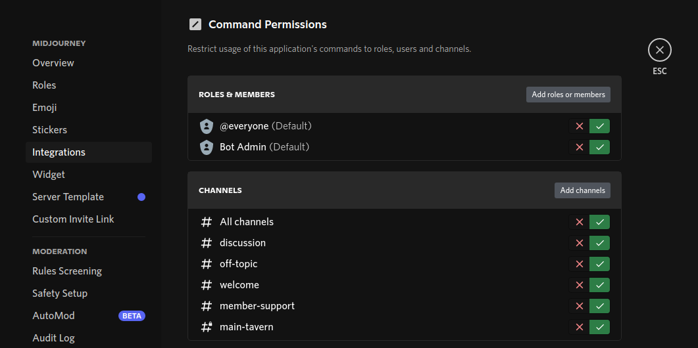

# Use Midjourney on your own Discord Server

**Currently the Midjourney Bot can only be used in servers with less than 10,000 members.**

## Invite the Midjourney Bot 

1. Select the **Midjourney Bo**t from the **User List**, and then click **"Add to Server"**:&#x20;

1. Select the server you want to add it to, then follow the directions in discord.

If you don't see your server listed, follow the instructions in [#step5-1](use-midjourney-on-your-own-discord-server.md#step5-1 "mention")

## Use the Midjourney Bot

Once the Midjourney Bot has joined your server you can begin interacting with it using the `/imagine` command.

If this is your first time using Midjourney, refer to othe [Quick Start Guide](./) for help making your first images.

## Notes


Midjourney images generated on private servers are still subject to the [content moderation policies](content-and-moderation-policy.md).



Images generated on private servers are still visible to other users on [midjourney.com](https://www.midjourney.com/app/feed/all/) (unless users have the Private Powers add-on enabled)



To use the Midjourney Bot in any server users must have an active Midjourney trial or subscription. Using the `/imagine` command for the first time command will automatically begin a trial membership for new users.


## Restrict the Bot to Specific Channels

If you do not want the Midjourney Bot to be usable in specific channels go to **Edit Channel**, select the **Permissions tab**, select **@everyone** under **Roles/Members** and  **\_Uncheck\_ "Use Application Commands"**.

Users who try to use the Midjourney Bot in a channel with these permissions disabled will not see the command

For more granular control go to **Settings**, select **Integrations**, select the **Permissions tab**, select the **+ for the Midjourney Bot**, and select **Manage Integration.** \
****\
****/Command permissions can then be set for individual roles and channels.

 

****\
**Get Midjourney Bot Status Updates and Announcements on Your Own Server**
--------------------------------------------------------------------------

Follow the **`#announcements`** and **`#status`** on your own server to stay up-to-date with Midjourney.

## Create an Administrator Role 

**Only individuals with the "Manage server" permissions can add the Midjourney Bot to that server. If you do not see your server in the list, make sure you have this permission.**

***

1. From your Discord Server's home page select the **Roles** tab in the **Server Settings** menu.

2\. Select the **Roles** tab and **Create Role.**

3\. Name the new role and enable **Manage Server Permissions**. **(Manager power level on mobile)**

4\. Select the **Manage Members** tab and add assign the new role to yourself.

5\. **Save** your changes.
